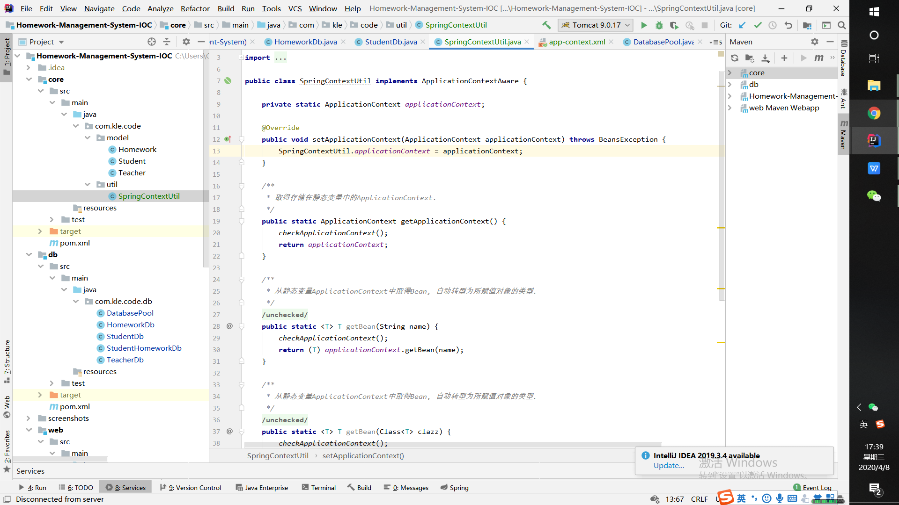
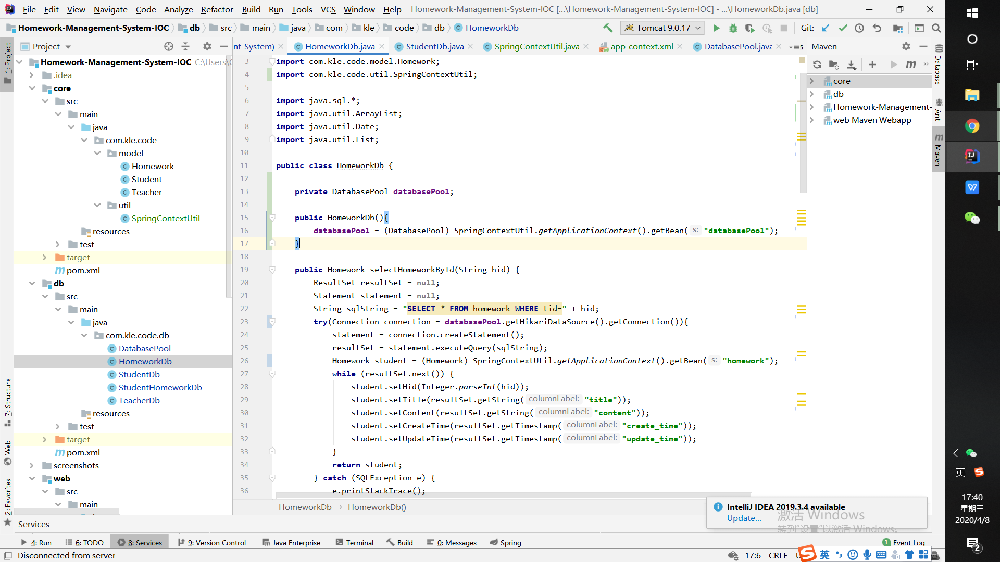

### 作业管理系统 （优化后的Java EE - Spring MVC - IOC） 

优化内容：
1. 使用IOC进行实例管理, 将原来app-context中的bean定义都改为注解
2. 使用@Autowired在构造器中自动装配,包括所有model下所有实例类(prototype)以及db下的DatabasePool(singleton)和所有Db类
2. 放弃自己写的单例DatabasePool,采用IOC管理,使用bean注册单例的DatabasePool(singleton)

3. 在core下新建一个util包，写了一个实现ApplicationContextAware接口的SpringContextUtil类，并在app-context.xml中注册，方便获取ApplicationContext

4. 使用：

5. 配置相关(详见web模块中的app-servlet.xml)
6. 将之前从req中取参改为@RequestParam

### 提取service层， 添加切面， 使用AOP实现事务

1. 目前的逻辑中只有三个绑定的(即非一个)SQL语句构建成的事务，分别是a.删除学生(需要删除学生作业关系) b.删除作业(需要删除学生作业关系) c.布置作业(需要添加学生作业关系)
2. com.kle.code.aop下的TransactionManager(切点即对应service中的三个方法)，为三个事务添加切点，利用切面对三个事务进行实现:@Before 关闭自动提交 @AfterReturning 正常执行后事务提交 @AfterThrowing 异常后事务回滚
3. 从之前的controller中提取service层(service.impl包下实现)
4. 使用ConnectionUtils(db包)利用ThreadLocal获取当前线程的数据库连接用来使用(提交，回滚...)、关闭，方便在TransactionManager获取当前线程数据库连接操作

### 改为springboot项目
1. 在pom文件中添加springboot相关依赖
2. 添加application.properties配置文件
3. 去除web.xml部分配置（包括对app-context, app-servlet的引用以及一些扫描等）
4. 添加config文件夹，设置springboot中的拦截器、默认路由、跨域配置等
5. 注：先吐槽下，不得不说springbooot使用jsp是真的费劲，需要添加好多依赖，这些我都在pom加了注释，
还有springboot的默认静态资源文件位置是在resources下，所以静态文件也得移到相应位置，另外对spring依赖部分做了一些小改进
